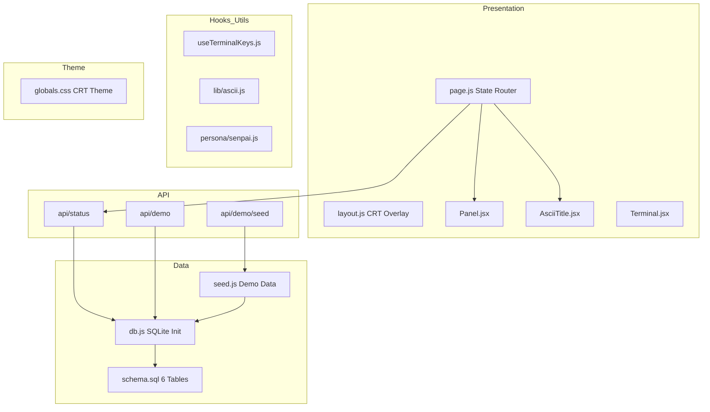
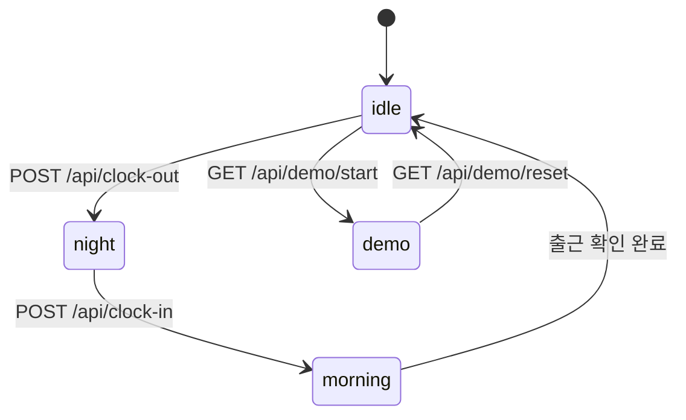
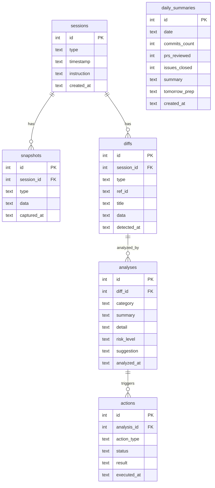

# 설계 문서: cs-senpai-core

## Overview

cs-senpai-core는 CS-Senpai 프로젝트의 공유 기반 레이어다. 3개의 상위 스펙(evening-handoff, night-engine, morning-brief)이 공통으로 의존하는 데이터 레이어, CRT 테마, 공유 컴포넌트, 유틸리티, 상태 라우팅, 데모 모드를 제공한다.

핵심 설계 원칙:
- 단일 진실 소스(Single Source of Truth): DB 스키마, 테마, 컴포넌트를 한 곳에서 관리
- 의존 방향 단방향: core → (evening-handoff | night-engine | morning-brief), 역방향 의존 금지
- 데모 우선: GitHub 연동 없이도 시드 데이터만으로 전체 UI 시연 가능

```
                    ┌─────────────────┐
                    │  cs-senpai-core  │
                    │                  │
                    │  db.js           │
                    │  schema.sql      │
                    │  seed.js         │
                    │  globals.css     │
                    │  Panel.jsx       │
                    │  AsciiTitle.jsx  │
                    │  Terminal.jsx    │
                    │  ascii.js        │
                    │  useTerminalKeys │
                    │  senpai.js       │
                    │  page.js         │
                    │  /api/status     │
                    │  /api/demo       │
                    └────────┬────────┘
                             │
              ┌──────────────┼──────────────┐
              ▼              ▼              ▼
     ┌────────────┐  ┌────────────┐  ┌────────────┐
     │  evening-   │  │   night-   │  │  morning-  │
     │  handoff    │  │   engine   │  │   brief    │
     └────────────┘  └────────────┘  └────────────┘
```

## Architecture

### 레이어 구조



### 상태 머신 (State Router)

page.js는 시스템 상태에 따라 3개 화면 중 하나를 렌더링한다:



| 상태 | 렌더링 화면 | 데이터 소스 |
|------|------------|------------|
| `idle` | EveningHandoff (퇴근 화면) | daily_summaries, sessions |
| `night` | NightMonitor (야간 모니터링) | diffs, analyses (실시간) |
| `morning` | MorningBrief (출근 대시보드) | analyses, actions, daily_summaries |
| `demo` | Timelapse (데모 재생) | seed data, 시간순 이벤트 |

### 파일 배치

```
src/
├── app/
│   ├── layout.js              # CRT 오버레이 + 전역 폰트/메타
│   ├── page.js                # State Router (idle/night/morning/demo)
│   ├── globals.css            # CRT 테마 CSS 전체
│   └── api/
│       ├── status/route.js    # GET: 현재 시스템 상태
│       └── demo/
│           ├── route.js       # GET: 데모 이벤트 스트림
│           └── seed/route.js  # POST: 시드 데이터 삽입
├── components/
│   ├── Panel.jsx              # tmux 스타일 패널
│   ├── AsciiTitle.jsx         # figlet ASCII 타이틀
│   └── Terminal.jsx           # CRT 터미널 컨테이너
├── core/
│   └── db.js                  # SQLite 초기화 + 쿼리 헬퍼
├── data/
│   ├── schema.sql             # 6 테이블 DDL
│   └── seed.js                # 데모 시드 데이터
├── persona/
│   └── senpai.js              # 선배 대사 생성기
├── hooks/
│   └── useTerminalKeys.js     # 전역 키보드 바인딩
└── lib/
    └── ascii.js               # figlet 래퍼 유틸
```

## Components and Interfaces

### 1. Data Layer: db.js

SQLite 초기화와 쿼리 헬퍼를 제공하는 싱글턴 모듈.

```js
// src/core/db.js (CJS)
const Database = require('better-sqlite3');

/**
 * SQLite DB 싱글턴 인스턴스를 반환한다.
 * 최초 호출 시 DB 파일 생성 + WAL 모드 + 스키마 초기화.
 * @param {string} [dbPath] - 기본값: process.env.DB_PATH || './data/cs-senpai.db'
 * @returns {object} { get, all, insert, run, raw }
 */
function getDb(dbPath) { ... }

// 쿼리 헬퍼 시그니처
function get(sql, params)    // -> row | undefined
function all(sql, params)    // -> row[]
function insert(table, obj)  // -> { id, changes }
function run(sql, params)    // -> { changes }
function raw()               // -> better-sqlite3 Database 인스턴스
```

설계 결정:
- 싱글턴 패턴: `let _db = null;` 모듈 스코프 캐싱. Next.js hot reload 시 `global.__db` 가드 사용.
- `insert(table, obj)`: obj의 키를 컬럼명으로, 값을 파라미터로 자동 매핑. SQL 인젝션 방지를 위해 prepared statement 사용.
- WAL 모드: `PRAGMA journal_mode = WAL` -- night-engine 쓰기와 morning-brief 읽기 동시 접근 지원.
- FOREIGN KEY: `PRAGMA foreign_keys = ON` -- 참조 무결성 강제.

### 2. Data Layer: schema.sql

```sql
-- src/data/schema.sql
CREATE TABLE IF NOT EXISTS sessions (
  id INTEGER PRIMARY KEY AUTOINCREMENT,
  type TEXT NOT NULL,
  timestamp TEXT NOT NULL,
  instruction TEXT,
  created_at TEXT NOT NULL DEFAULT (datetime('now'))
);

CREATE TABLE IF NOT EXISTS snapshots (
  id INTEGER PRIMARY KEY AUTOINCREMENT,
  session_id INTEGER NOT NULL REFERENCES sessions(id),
  type TEXT NOT NULL,
  data TEXT NOT NULL,
  captured_at TEXT NOT NULL DEFAULT (datetime('now'))
);

CREATE TABLE IF NOT EXISTS diffs (
  id INTEGER PRIMARY KEY AUTOINCREMENT,
  session_id INTEGER NOT NULL REFERENCES sessions(id),
  type TEXT NOT NULL,
  ref_id TEXT NOT NULL,
  title TEXT NOT NULL,
  data TEXT NOT NULL,
  detected_at TEXT NOT NULL DEFAULT (datetime('now'))
);

CREATE TABLE IF NOT EXISTS analyses (
  id INTEGER PRIMARY KEY AUTOINCREMENT,
  diff_id INTEGER NOT NULL REFERENCES diffs(id),
  category TEXT NOT NULL,
  summary TEXT NOT NULL,
  detail TEXT NOT NULL,
  risk_level TEXT NOT NULL,
  suggestion TEXT,
  analyzed_at TEXT NOT NULL DEFAULT (datetime('now'))
);

CREATE TABLE IF NOT EXISTS actions (
  id INTEGER PRIMARY KEY AUTOINCREMENT,
  analysis_id INTEGER NOT NULL REFERENCES analyses(id),
  action_type TEXT NOT NULL,
  status TEXT NOT NULL,
  result TEXT,
  executed_at TEXT NOT NULL DEFAULT (datetime('now'))
);

CREATE TABLE IF NOT EXISTS daily_summaries (
  id INTEGER PRIMARY KEY AUTOINCREMENT,
  date TEXT NOT NULL UNIQUE,
  commits_count INTEGER NOT NULL DEFAULT 0,
  prs_reviewed INTEGER NOT NULL DEFAULT 0,
  issues_closed INTEGER NOT NULL DEFAULT 0,
  summary TEXT NOT NULL,
  tomorrow_prep TEXT,
  created_at TEXT NOT NULL DEFAULT (datetime('now'))
);
```

### 3. Data Layer: seed.js

```js
// src/data/seed.js (CJS)

/**
 * 데모용 시드 데이터를 DB에 삽입한다.
 * 기존 데이터를 DELETE 후 INSERT (멱등성).
 * @param {object} db - getDb() 반환 객체
 * @returns {{ inserted: Record<string, number> }}
 */
function seedAll(db) { ... }
```

시드 데이터 구성:
- sessions: clock_out 1건 (어젯밤 18:00), clock_in 1건 (오늘 09:00)
- snapshots: baseline 1건 (PR 3개, Issue 5개, CI 2개 워크플로우)
- diffs: new_pr 1건, ci_fail 1건, new_issue 1건
- analyses: auto 1건 (dependabot), approve 1건 (PR 리뷰), direct 1건 (CI 실패)
- actions: auto 처리 완료 1건 (dependabot merge)
- daily_summaries: 어제 날짜 요약 1건

### 4. Presentation: Panel.jsx

tmux 스타일 보더와 라벨을 가진 재사용 패널.

```jsx
// src/components/Panel.jsx
'use client';

/**
 * @param {object} props
 * @param {string} props.title - 패널 상단 라벨 (예: "오늘 한 일")
 * @param {React.ReactNode} props.children
 * @param {string} [props.className] - 추가 CSS 클래스
 * @param {'green'|'amber'|'cyan'|'red'} [props.color='green'] - 보더/라벨 색상
 * @param {boolean} [props.noScanline=false] - true면 .no-scanline 적용
 */
export default function Panel({ title, children, className, color, noScanline }) { ... }
```

렌더링 구조:
```html
<div class="panel panel--{color} {noScanline ? 'no-scanline' : ''} {className}">
  <div class="panel__label">-- {title} --</div>
  <div class="panel__content">{children}</div>
</div>
```

### 5. Presentation: AsciiTitle.jsx

figlet으로 생성한 ASCII 아트 타이틀을 렌더링한다.

```jsx
// src/components/AsciiTitle.jsx
'use client';

/**
 * @param {object} props
 * @param {string} props.text - ASCII 아트로 변환할 텍스트
 * @param {'green'|'amber'|'cyan'} [props.color='amber'] - 텍스트 색상
 * @param {string} [props.font='ANSI Shadow'] - figlet 폰트
 */
export default function AsciiTitle({ text, color, font }) { ... }
```

구현 노트:
- `lib/ascii.js`의 `renderAscii(text, font)` 호출
- `<pre>` 태그로 래핑, `text-shadow` 글로우 적용
- 폰트 로딩 실패 시 일반 텍스트 폴백

### 6. Presentation: Terminal.jsx

CRT 효과를 래핑하는 최상위 터미널 컨테이너.

```jsx
// src/components/Terminal.jsx
'use client';

/**
 * @param {object} props
 * @param {React.ReactNode} props.children
 * @param {boolean} [props.fullScreen=true] - 전체 화면 모드
 * @param {string} [props.className]
 */
export default function Terminal({ children, fullScreen, className }) { ... }
```

렌더링 구조:
```html
<div class="terminal {fullScreen ? 'terminal--full' : ''} {className}">
  <div class="terminal__screen">{children}</div>
  <div class="terminal__vignette"></div>
</div>
```

### 7. Utility: lib/ascii.js

```js
// src/lib/ascii.js (CJS)
const figlet = require('figlet');

/**
 * figlet으로 ASCII 아트 텍스트를 생성한다.
 * @param {string} text
 * @param {string} [font='ANSI Shadow']
 * @returns {Promise<string>} ASCII 아트 문자열
 */
async function renderAscii(text, font) { ... }

/**
 * 사용 가능한 figlet 폰트 목록을 반환한다.
 * @returns {Promise<string[]>}
 */
async function listFonts() { ... }
```

### 8. Hook: useTerminalKeys.js

```js
// src/hooks/useTerminalKeys.js
'use client';
import { useEffect } from 'react';

/**
 * 전역 키보드 바인딩을 등록한다.
 * @param {Record<string, () => void>} keyMap
 *   키: 키 이름 (예: '1', '2', 'q', 'b', 'Escape')
 *   값: 핸들러 함수
 * @param {object} [options]
 * @param {boolean} [options.enabled=true] - 바인딩 활성화 여부
 */
export function useTerminalKeys(keyMap, options) { ... }
```

구현 노트:
- `document.addEventListener('keydown', handler)` 사용
- input/textarea 포커스 시 바인딩 비활성화 (이벤트 타겟 체크)
- cleanup: useEffect return에서 removeEventListener

### 9. Persona: senpai.js

```js
// src/persona/senpai.js (CJS)

/**
 * 카테고리별 선배 대사를 랜덤 반환한다.
 * @param {'greeting_evening'|'greeting_morning'|'night_start'|'night_idle'|
 *         'review_done'|'ci_fail'|'auto_action'|'farewell'} category
 * @param {object} [context] - 템플릿 변수 (예: { count: 3, prNumber: 42 })
 * @returns {string} 선배 톤 대사
 */
function speak(category, context) { ... }

// 대사 템플릿 예시
const TEMPLATES = {
  greeting_evening: [
    '퇴근이야? 그래 가. 나야 밤새지 뭐.',
    '오늘도 수고했다. 나머지는 내가 볼게.',
    '가긴 가는데... 뭐 특별히 봐줄 거 있어?',
  ],
  greeting_morning: [
    '왔어? 밤새 {count}건 처리했다. 감사는 커피로 받을게.',
    '출근이야? 어젯밤 좀 바빴어. 일단 앉아서 봐.',
    '오, 왔구나. 별 일 없었다고... 는 거짓말이고.',
  ],
  review_done: [
    'PR #{prNumber} 봤는데, {riskLevel}이야. {suggestion}',
  ],
  ci_fail: [
    'CI 또 터졌다. {workflow} 파이프라인인데, {errorSummary}',
  ],
  auto_action: [
    '{actionType} 자동으로 처리했다. 확인만 해.',
  ],
  farewell: [
    '수고했다. 맡겨만 둬. 밤새 꼼꼼히 볼게.',
  ],
};
```

설계 결정:
- 템플릿 변수는 `{varName}` 형식으로 단순 문자열 치환 (정규식 replace)
- 랜덤 선택: `Math.random()` 기반, 같은 대사 연속 방지를 위해 마지막 인덱스 캐싱
- 카테고리가 없으면 빈 문자열 반환 (에러 throw 안 함)

### 10. API: /api/status

```js
// src/app/api/status/route.js
// GET /api/status
// Response: { status: 'idle'|'night'|'morning'|'demo', session?: object }
```

상태 판정 로직:
1. sessions 테이블에서 최신 레코드 조회
2. 최신이 `clock_out`이면 -> `night`
3. 최신이 `clock_in`이면 -> daily_summaries에 오늘 날짜 존재 여부로 `morning` / `idle` 판정
4. 레코드 없으면 -> `idle`
5. demo 모드는 별도 플래그 (`global.__demoMode`)

### 11. API: /api/demo

```js
// src/app/api/demo/route.js
// GET /api/demo -- 데모 이벤트 목록 반환
// Response: { events: Array<{ time, type, data }> }

// src/app/api/demo/seed/route.js
// POST /api/demo/seed -- 시드 데이터 삽입 + 데모 모드 활성화
// Response: { ok: true, inserted: Record<string, number> }
```

### 12. State Router: page.js

```jsx
// src/app/page.js
'use client';

/**
 * 시스템 상태에 따라 적절한 화면 컴포넌트를 렌더링한다.
 * - idle -> EveningHandoff (evening-handoff 스펙)
 * - night -> NightMonitor (night-engine 스펙)
 * - morning -> MorningBrief (morning-brief 스펙)
 * - demo -> Timelapse
 *
 * 상태는 /api/status를 폴링하여 결정 (5초 간격).
 */
export default function Home() { ... }
```

### 13. CRT Theme: globals.css

CSS 아키텍처:

```
globals.css
+-- CSS Variables (:root)
|   +-- --term-green, --term-amber, --term-cyan
|   +-- --term-red, --term-yellow
|   +-- --term-bg, --term-border
|   +-- --font-mono
+-- @font-face (JetBrains Mono)
+-- Base Styles (body, *, pre, code)
+-- CRT Effects
|   +-- body::after (scanline overlay)
|   +-- .terminal__vignette (box-shadow vignetting)
|   +-- .crt-glow (text-shadow)
+-- Animations
|   +-- @keyframes blink
|   +-- @keyframes slideUp
|   +-- @keyframes typing
+-- Panel Styles
|   +-- .panel, .panel__label, .panel__content
|   +-- .panel--green, .panel--amber, .panel--cyan, .panel--red
+-- Status Colors
|   +-- .status-auto (green)
|   +-- .status-approve (yellow)
|   +-- .status-direct (red)
+-- Terminal Styles
|   +-- .terminal, .terminal--full
|   +-- .terminal__screen
+-- Utility Classes
|   +-- .no-scanline
|   +-- .cursor-blink
|   +-- .typing-effect
+-- Recharts Overrides
    +-- .recharts-cartesian-axis-tick text
    +-- .recharts-cartesian-grid line
    +-- .recharts-area, .recharts-bar
```

핵심 CSS 값:
- 스캔라인: `repeating-linear-gradient(0deg, transparent, transparent 1px, rgba(0,0,0,0.3) 2px, transparent 3px)`
- 글로우: `text-shadow: 0 0 5px rgba(0,255,65,0.4)`
- 비네팅: `box-shadow: inset 0 0 100px rgba(0,0,0,0.8)`
- 최소 폰트: `font-size: max(14px, 0.875rem)`
- recharts 축 틱: `fill: var(--term-green); font-family: var(--font-mono); font-size: 10px`

## Data Models

### Entity Relationship Diagram



### 테이블별 역할과 소비자

| 테이블 | 쓰기 주체 | 읽기 주체 | JSON 컬럼 |
|--------|-----------|-----------|-----------|
| sessions | evening-handoff, morning-brief | page.js (상태 판정), 전체 | - |
| snapshots | night-engine (scanner) | night-engine (differ) | data |
| diffs | night-engine (differ) | morning-brief, night-engine | data |
| analyses | night-engine (analyzer) | morning-brief | detail |
| actions | night-engine, morning-brief | morning-brief | - |
| daily_summaries | night-engine (summarizer) | evening-handoff, morning-brief | tomorrow_prep |

### JSON 컬럼 상세 스키마

snapshots.data:
```json
{
  "prs": [{ "number": 42, "title": "...", "author": "...", "state": "open" }],
  "issues": [{ "number": 10, "title": "...", "labels": [] }],
  "ci": [{ "workflow": "test", "run_id": 123, "status": "success" }],
  "commits": [{ "sha": "abc123", "message": "...", "author": "..." }]
}
```

diffs.data (type별):
```json
{ "number": 43, "title": "...", "author": "...", "files_changed": 5 }
```

analyses.detail: output-schema.md의 에이전트별 detail 스키마를 따른다.

daily_summaries.tomorrow_prep:
```json
[
  { "type": "pr", "ref": "#43", "title": "...", "priority": "high", "reason": "..." }
]
```

### 핵심 쿼리 패턴

```sql
-- 현재 시스템 상태 판정
SELECT type, timestamp, instruction
FROM sessions ORDER BY id DESC LIMIT 1;

-- 야간 분석 결과 조회
SELECT a.*, d.type as diff_type, d.title as diff_title, d.ref_id
FROM analyses a
JOIN diffs d ON a.diff_id = d.id
WHERE d.session_id = ?
ORDER BY a.analyzed_at DESC;

-- 오늘 요약 조회
SELECT * FROM daily_summaries WHERE date = date('now') LIMIT 1;
```

## Correctness Properties

*A property is a characteristic or behavior that should hold true across all valid executions of a system -- essentially, a formal statement about what the system should do. Properties serve as the bridge between human-readable specifications and machine-verifiable correctness guarantees.*

### Property 1: Schema completeness

*For any* freshly initialized database (with any valid file path), all 6 tables (sessions, snapshots, diffs, analyses, actions, daily_summaries) should exist and each table should contain exactly the columns specified in schema.sql with the correct types.

**Validates: Requirements 2.1, 2.2, 2.3, 2.4, 2.5, 2.6, 3.4**

### Property 2: Foreign key enforcement

*For any* row inserted into a child table (snapshots, diffs, analyses, actions) with a foreign key value that does not exist in the parent table, the insert should be rejected with an error.

**Validates: Requirements 2.7**

### Property 3: Insert/query round-trip

*For any* valid row object (with non-null required fields), inserting it via `db.insert(table, obj)` and then querying it back via `db.get()` should return an object with all the same field values as the original.

**Validates: Requirements 3.5**

### Property 4: Seed idempotency

*For any* number of consecutive `seedAll(db)` executions (N >= 1), the resulting row counts in all 6 tables should be identical to a single execution, and the data content should be equivalent.

**Validates: Requirements 4.7**

### Property 5: Senpai speak template substitution

*For any* category and context object where the context contains all variables referenced in the template, `speak(category, context)` should return a string that contains none of the `{varName}` placeholder patterns and contains all the context values as substrings.

**Validates: Requirements (persona module correctness)**

### Property 6: Status API state derivation

*For any* sequence of session records (clock_out and clock_in), the status API should return a state consistent with the most recent session type: `clock_out` maps to `night`, `clock_in` maps to `morning` or `idle` depending on daily_summaries existence, and empty sessions maps to `idle`.

**Validates: Requirements (status API correctness)**

## Error Handling

### DB 초기화 실패
- 잘못된 경로 또는 권한 문제 시 pino로 에러 로깅
- 명확한 에러 메시지 반환
- 프로세스 종료하지 않음 (API 라우트에서 500 응답)

### 스키마 마이그레이션
- CREATE TABLE IF NOT EXISTS 사용으로 기존 데이터 보존
- v1에서는 자동 마이그레이션 미지원, 수동 처리

### 시드 데이터 충돌
- seedAll()은 DELETE 후 INSERT, 트랜잭션 내 실행
- FK 순서 준수하여 삽입, 역순으로 삭제

### figlet 폰트 로딩 실패
- 폰트 미발견 시 기본 폰트 Standard로 폴백
- 기본 폰트도 실패 시 원본 텍스트 그대로 반환

### API 라우트 에러
- 모든 API 라우트는 try-catch 감싸고 500 응답
- DB 연결 실패 시 503 Service Unavailable

### useTerminalKeys 안전장치
- input/textarea 포커스 시 키 바인딩 자동 비활성화
- 컴포넌트 언마운트 시 이벤트 리스너 정리 보장
